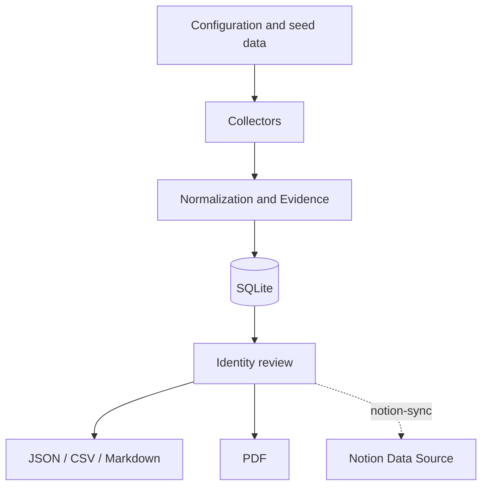

# Digital Footprint Map Generator

[Português](README.md) | [English](README.en.md)

A reproducible project for collecting, recording, reviewing, and publishing
public evidence about Aridio Silva's digital footprint. The package separates
**data collection** from **report generation**.

## What's included

- collectors for web pages, GitHub, and OpenAlex;
- manual import of Google Scholar and National Library results;
- an SQLite database with audit trail and hashes;
- normalization, deduplication, and identity review;
- JSON, CSV, and Markdown export;
- PDF generation;
- previous reports in `docs/relatorios/`;
- initial bibliographic data and known references;
- optional, idempotent, explicit synchronization with a Notion data source;
- automated tests and an execution example.

The software only collects publicly accessible content and does not attempt to
bypass logins, CAPTCHAs, `robots.txt`, or access restrictions. A person must
review results before publication, especially to prevent mistaken identity.

## Installation

Python 3.11 or later is required.

```bash
python -m venv .venv
source .venv/bin/activate        # Windows: .venv\Scripts\activate
pip install -e '.[dev]'
cp .env.example .env
```

## Tests

Install development dependencies and run the complete suite:

```bash
pip install -e '.[dev]'
python -m pytest
python -m ruff check .
```

To test only the Notion integration, without a token or account access:

```bash
python -m pytest tests/test_notion_sync.py
```

Tests use temporary directories and simulated clients; they do not write to the
project SQLite database or send data to Notion. The suite covers models,
database deduplication, exports, and idempotent Notion synchronization.
External-source collection remains subject to manual verification because it
depends on the availability, policies, and content of public services.

GitHub Actions runs the same tests and lint automatically for pull requests and
changes to `main`.

## Updates and `main` protection

The `main` branch is the stable project version and has an active ruleset:

- changes must arrive through a pull request; direct pushes to `main` are not allowed;
- branch deletion and force pushes are blocked;
- the required `test` check must succeed before merge;
- required approvals are set to zero, so the maintainer can merge their own PR
  after the check passes.

To update the project, create a branch, publish it, and open a pull request:

```bash
git switch -c feat/my-change
git add .
git commit -m "Describe the change"
git push -u origin feat/my-change
```

Once CI is green, the pull request can be merged into `main`. This protects the
stable history without requiring another reviewer.

## Quick start

```bash
pegada init
pegada import-seed data/seed/evidencias_iniciais.json
pegada collect --config config/collector.toml
pegada export --all
pegada report --format pdf
```

Output files are written to `output/`. For an offline demonstration:

```bash
pegada init && pegada import-seed data/seed/evidencias_iniciais.json
pegada export --all && pegada report --format pdf
```

## Google Scholar and National Library

The project does not automatically scrape Google Scholar. Export or record
confirmed results in `data/import/google_scholar.csv`. National Library records
can be added to `data/import/biblioteca_nacional.csv`. Then run:

```bash
pegada import-csv data/import/google_scholar.csv --kind citation
pegada import-csv data/import/biblioteca_nacional.csv --kind book
```

## Notion integration

1. Create an integration at `notion.so/profile/integrations` and copy its token.
2. In Notion, create a data source with the columns described in
   `docs/INTEGRACAO_NOTION.md`, then share it with the integration.
3. Copy `.env.example` to `.env` and set `NOTION_TOKEN` and
   `NOTION_DATA_SOURCE_ID`.
4. Install and simulate before writing:

```bash
pip install -e '.[notion]'
pegada notion-sync --dry-run --only-reviewed
pegada notion-sync --only-reviewed
```

Synchronization uses `Fingerprint` to create or update pages without duplicate
records. The connector validates remote columns before execution, supports the
current `data_source_id` API, and sends nothing without an explicit
`notion-sync` command. See `docs/INTEGRACAO_NOTION.md` for full configuration.

## Project structure

```text
Digital_Footprint_Map/
├── .env.example                         # Environment variables and optional credentials template.
├── .gitignore                           # Local files and generated data excluded from version control.
├── LICENSE                              # Project license.
├── Makefile                             # Shortcuts for installation, tests, and common tasks.
├── pyproject.toml                       # Version 1.1, dependencies, and Python package configuration.
├── README.md                            # Portuguese overview, setup, usage, and guidance.
├── README.en.md                         # English overview, setup, usage, and guidance.
│
├── config/
│   └── collector.toml                   # Public sources and configurable collector parameters.
│
├── data/
│   ├── import/
│   │   ├── biblioteca_nacional.csv      # Manually imported bibliographic records.
│   │   └── google_scholar.csv           # Confirmed works and citations for manual import.
│   ├── seed/
│   │   └── evidencias_iniciais.json     # Initial evidence set for offline demonstration.
│   └── pegada.sqlite3                   # Local SQLite database with evidence and audit trail.
│
├── docs/
│   ├── ARQUITETURA.md                   # System architecture and components.
│   ├── DICIONARIO_DE_DADOS.md           # Fields, entities, and collected-data meanings.
│   ├── INTEGRACAO_NOTION.md             # Notion schema, credentials, and safe synchronization.
│   ├── MAPA_DO_COLETOR.md               # Collector workflow and scope.
│   ├── METODOLOGIA.md                   # Collection, review, and validation criteria.
│   └── relatorios/                      # Reference PDF reports.
│
├── output/                              # Generated evidence exports and reports.
├── src/
│   └── pegada/
│       ├── cli.py                       # `pegada` command-line interface.
│       ├── collectors.py                # Public-source evidence collection.
│       ├── config.py                    # Configuration loading and validation.
│       ├── db.py                        # SQLite persistence and audit trail.
│       ├── exporters.py                 # JSON, CSV, and Markdown exports.
│       ├── importers.py                 # CSV and seed-data import.
│       ├── models.py                    # Evidence models and normalization.
│       ├── notion_sync.py               # Idempotent, explicit Notion synchronization.
│       └── report.py                    # Digital footprint report generation.
│
└── tests/                               # Automated tests for the package and Notion integration.
```

## Detailed documentation

### Architecture



The SHA-256 `fingerprint` prevents exact duplication by URL, title, and
category. Identity status starts as `pending`; only reviewed evidence should be
marked `reviewed`. Collectors fail independently so that an unavailable source
does not interrupt the others.

Notion publishing is explicit and idempotent. Before writing, the connector
validates the remote schema and queries existing fingerprints. Each evidence
record is then created or updated; `--dry-run` lets you inspect the plan
without changes.

### Complete collector map

| Stage | Input | Component | Output |
|---|---|---|---|
| Configuration | TOML and environment variables | `config.py` | sources and limits |
| Web collection | Public URL | `WebCollector` | title, summary, final URL |
| GitHub | Public user | `GitHubCollector` | profile and repositories |
| Academic | Name query | `OpenAlexCollector` | candidate works |
| Import | Reviewed CSV/JSON | `importers.py` | structured evidence |
| Normalization | Heterogeneous data | `Evidence` | unified schema and hash |
| Persistence | Evidence | `Repository` | auditable SQLite |
| Publication | Reviewed database | `exporters.py`, `report.py` | JSON, CSV, MD, and PDF |
| Notion integration | Reviewed database | `notion_sync.py` | pages in the Notion data source |

#### Operating rules

1. Do not bypass authentication, CAPTCHAs, or access restrictions.
2. Respect `robots.txt`, request intervals, and terms of use.
3. Treat name-search results as candidates until identity review is complete.
4. Record URL, source, date, confidence, and notes.
5. Do not claim Google Scholar counts without current verification.
6. Separate observed facts, inferences, and statements from the subject.

### Methodology

The map follows the chain: professional trajectory -> books -> academic
references -> GitHub -> articles -> artificial intelligence.

#### Classification

- `reviewed`: identity confirmed by multiple signals or by the subject;
- `pending`: candidate not yet validated;
- `rejected`: namesake or incorrect attribution;
- confidence from 0 to 1 expresses attribution strength, not content quality.

#### Sources

Primary and institutional sources should take priority. Search results are
leads, not final sources. Google Scholar must be imported manually; National
Library records should include their official URL or number. Citations should
identify the work that uses the source and, when possible, its page and a short
excerpt.

#### LGPD and ethics

Collect only public data relevant to the purpose. Avoid sensitive data,
addresses, telephone numbers, and family information. Document corrections and
removals. Do not republish complete pages or protected content.

### Data dictionary

| Field | Meaning |
|---|---|
| `title` | evidence title |
| `url` | stable address or URN |
| `source` | editorial or institutional origin |
| `category` | profile, book, academic, repository, etc. |
| `snippet` | short summary without copying extended content |
| `published_at` | publication date or year |
| `authors` | authors declared by the source |
| `identifiers` | ISBN, DOI, OpenAlex, and others |
| `collected_at` | UTC collection timestamp |
| `identity_status` | pending, reviewed, or rejected |
| `confidence` | confidence from 0 to 1 |
| `notes` | caveats and validation tasks |
| `fingerprint` | SHA-256 used for deduplication |

## License

Copyright (c) 2026 Aridio Silva. This project is distributed under the
[Apache License 2.0](LICENSE).

The license permits use, copying, modification, and distribution, including
commercial use, provided that the license and applicable notices are retained.
It also includes an express patent grant and does not require derivative works
to be released as open source.

## Notice

This is a defensive OSINT and self-audit tool. Respect LGPD, copyright, site
terms, and removal requests. URLs and excerpts are evidence; they do not
automatically confirm identity.
