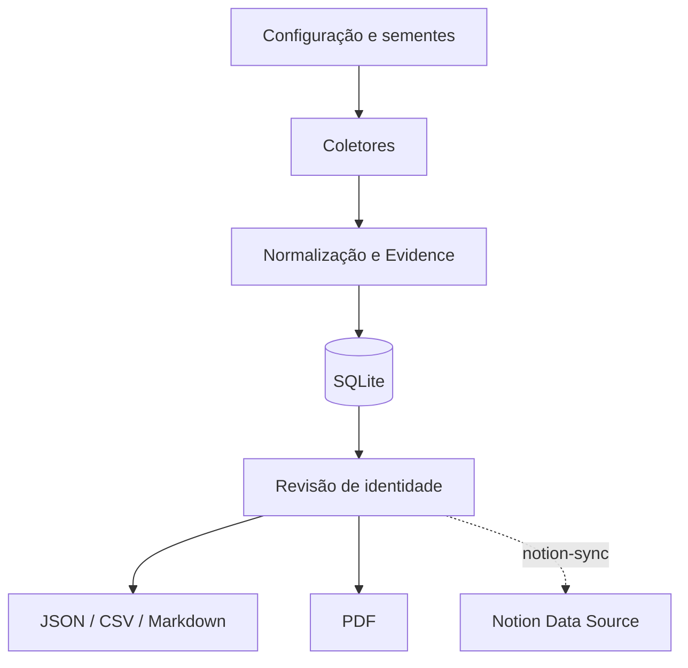

# Gerador do Mapa da Pegada Digital

Projeto reproduzível para coletar, registrar, revisar e publicar evidências públicas sobre a pegada digital de Aridio Silva. O pacote separa a **coleta de dados** da **geração do relatório**.

## O que está incluído

- coletores para páginas web, GitHub e OpenAlex;
- importação manual de resultados do Google Acadêmico e da Biblioteca Nacional;
- banco SQLite com trilha de auditoria e hashes;
- normalização, deduplicação e revisão de identidade;
- exportação JSON, CSV e Markdown;
- geração de PDF;
- relatórios anteriores em `docs/relatorios/`;
- dados bibliográficos iniciais e referências conhecidas;
- sincronização opcional, idempotente e explícita com uma fonte de dados do Notion;
- testes automatizados e exemplo de execução.

O software coleta apenas conteúdo publicamente acessível e não tenta contornar login, CAPTCHA, robots.txt ou bloqueios. Resultados devem ser revisados por uma pessoa antes da publicação, sobretudo para evitar homônimos.

## Instalação

Requer Python 3.11 ou superior.

```bash
python -m venv .venv
source .venv/bin/activate        # Windows: .venv\\Scripts\\activate
pip install -e '.[dev]'
cp .env.example .env
```

## Testes

Instale as dependências de desenvolvimento e execute a suíte completa:

```bash
pip install -e '.[dev]'
python -m pytest
python -m ruff check .
```

Para testar apenas a integração com o Notion, sem token nem acesso à conta:

```bash
python -m pytest tests/test_notion_sync.py
```

Os testes usam diretórios temporários e clientes simulados; não gravam no
SQLite do projeto nem enviam dados ao Notion. A suíte cobre modelos,
deduplicação no banco, exportações e a sincronização idempotente do Notion.
As coletas de fontes externas devem continuar sendo verificadas manualmente,
pois dependem de disponibilidade, políticas e conteúdo de serviços públicos.

Em pull requests e alterações na `main`, o GitHub Actions executa os mesmos
testes e o lint automaticamente.

## Atualizações e proteção da `main`

A branch `main` é a versão estável do projeto e possui um ruleset ativo:

- alterações devem ser enviadas por pull request; não há envio direto à `main`;
- exclusão da branch e *force push* são bloqueados;
- o check obrigatório `test` deve concluir com sucesso antes do merge;
- a revisão obrigatória está configurada como zero, permitindo que o mantenedor
  integre a própria PR depois que o check estiver aprovado.

Para atualizar o projeto, crie uma branch, publique-a e abra uma pull request:

```bash
git switch -c feat/minha-alteracao
git add .
git commit -m "Descreva a alteração"
git push -u origin feat/minha-alteracao
```

Depois de a CI ficar verde, a pull request poderá ser integrada à `main`. Esse
fluxo protege o histórico estável sem exigir a participação de outro revisor.

## Uso rápido

```bash
pegada init
pegada import-seed data/seed/evidencias_iniciais.json
pegada collect --config config/collector.toml
pegada export --all
pegada report --format pdf
```

Saídas são gravadas em `output/`. Para uma demonstração offline:

```bash
pegada init && pegada import-seed data/seed/evidencias_iniciais.json
pegada export --all && pegada report --format pdf
```

## Google Acadêmico e Biblioteca Nacional

O projeto não raspa automaticamente o Google Acadêmico. Exporte/registre os resultados confirmados em `data/import/google_scholar.csv`. Registros da Biblioteca Nacional podem ser inseridos em `data/import/biblioteca_nacional.csv`. Depois execute:

```bash
pegada import-csv data/import/google_scholar.csv --kind citation
pegada import-csv data/import/biblioteca_nacional.csv --kind book
```

## Integração com o Notion

1. Crie uma integração em `notion.so/profile/integrations` e copie o token.
2. No Notion, crie uma fonte de dados com as colunas descritas em
   `docs/INTEGRACAO_NOTION.md` e compartilhe-a com a integração.
3. Copie `.env.example` para `.env` e preencha `NOTION_TOKEN` e
   `NOTION_DATA_SOURCE_ID`.
4. Instale e simule antes de gravar:

```bash
pip install -e '.[notion]'
pegada notion-sync --dry-run --only-reviewed
pegada notion-sync --only-reviewed
```

A sincronização usa o campo `Fingerprint` para criar ou atualizar páginas sem
duplicar registros. O conector valida as colunas remotas antes da execução,
suporta a API atual baseada em `data_source_id` e não envia dados sem o comando
explícito `notion-sync`. Consulte `docs/INTEGRACAO_NOTION.md` para a
configuração completa.

## Estrutura do Projeto

```text
Digital_Footprint_Map/
├── .env.example                         # Modelo de variáveis de ambiente e credenciais opcionais.
├── .gitignore                           # Arquivos locais e dados gerados que não devem ser versionados.
├── LICENSE                              # Licença de uso do projeto.
├── Makefile                             # Atalhos para instalação, testes e execução das tarefas comuns.
├── pyproject.toml                       # Versão 1.1, dependências e configuração do pacote Python.
├── README.md                            # Visão geral, instalação, uso e orientações do projeto.
│
├── config/
│   └── collector.toml                   # Fontes públicas e parâmetros configuráveis dos coletores.
│
├── data/
│   ├── import/
│   │   ├── biblioteca_nacional.csv      # Registros bibliográficos importados manualmente.
│   │   └── google_scholar.csv           # Citações e obras confirmadas para importação manual.
│   ├── seed/
│   │   └── evidencias_iniciais.json     # Conjunto inicial de evidências para demonstração offline.
│   └── pegada.sqlite3                   # Banco SQLite local com evidências e trilha de auditoria.
│
├── docs/
│   ├── ARQUITETURA.md                   # Arquitetura e componentes do sistema.
│   ├── DICIONARIO_DE_DADOS.md           # Campos, entidades e significado dos dados coletados.
│   ├── INTEGRACAO_NOTION.md              # Esquema, credenciais e execução segura da sincronização.
│   ├── MAPA_DO_COLETOR.md               # Fluxo e escopo dos coletores de evidências.
│   ├── METODOLOGIA.md                   # Critérios de coleta, revisão e validação das evidências.
│   └── relatorios/
│       ├── Mapa_Pegada_Digital_Aridio_Silva.pdf
│       │                                # Relatório PDF de referência do mapa digital.
│       └── Mapa_Pegada_Digital_Aridio_Silva_Atualizado_Bibliografia.pdf
│                                        # Relatório PDF com bibliografia e citações atualizadas.
│
├── output/
│   ├── .gitkeep                         # Mantém o diretório de saídas no repositório.
│   ├── evidencias.csv                   # Exportação tabular de evidências gerada pela CLI.
│   ├── evidencias.json                  # Exportação JSON de evidências gerada pela CLI.
│   ├── mapa_pegada_digital.md           # Relatório Markdown gerado.
│   └── Mapa_Pegada_Digital_Aridio_Silva_Gerado.pdf
│                                        # Relatório PDF gerado a partir das evidências.
│
├── src/
│   └── pegada/
│       ├── __init__.py                  # Identifica o pacote Python.
│       ├── cli.py                       # Comandos da interface de linha de comando `pegada`.
│       ├── collectors.py                # Coleta conteúdo de fontes públicas autorizadas.
│       ├── config.py                    # Leitura e validação das configurações.
│       ├── db.py                        # Persistência SQLite e trilha de auditoria.
│       ├── exporters.py                 # Exportação de evidências em JSON, CSV e Markdown.
│       ├── importers.py                 # Importação de dados CSV e conjuntos iniciais.
│       ├── models.py                    # Modelos e normalização das entidades de evidência.
│       ├── notion_sync.py               # Sincronização idempotente e explícita com o Notion.
│       └── report.py                    # Geração dos relatórios do mapa da pegada digital.
│
└── tests/
    ├── test_db.py                       # Testes da persistência e auditoria no SQLite.
    ├── test_exporters.py                # Testes das exportações de dados e relatórios.
    ├── test_models.py                   # Testes dos modelos e da normalização de evidências.
    └── test_notion_sync.py               # Testes da idempotência, esquema e modo de simulação do Notion.
```

## Documentação detalhada

### Arquitetura



O `fingerprint` SHA-256 impede duplicação exata por URL, título e categoria. O
status de identidade começa como `pending`; apenas evidências revisadas devem
receber `reviewed`. Coletores falham isoladamente para que uma origem
indisponível não interrompa as demais.

A publicação no Notion é explícita e idempotente. Antes de gravar, o conector
valida o esquema remoto e consulta os fingerprints existentes. Cada evidência é
então criada ou atualizada; `--dry-run` permite verificar o plano sem
alterações.

### Mapa completo do coletor

| Etapa | Entrada | Componente | Saída |
|---|---|---|---|
| Configuração | TOML e variáveis de ambiente | `config.py` | fontes e limites |
| Coleta web | URL pública | `WebCollector` | título, resumo, URL final |
| GitHub | usuário público | `GitHubCollector` | perfil e repositórios |
| Acadêmico | consulta nominal | `OpenAlexCollector` | trabalhos candidatos |
| Importação | CSV/JSON revisado | `importers.py` | evidências estruturadas |
| Normalização | dados heterogêneos | `Evidence` | esquema único e hash |
| Persistência | evidências | `Repository` | SQLite auditável |
| Publicação | banco revisado | `exporters.py`, `report.py` | JSON, CSV, MD e PDF |
| Integração com Notion | banco revisado | `notion_sync.py` | páginas na fonte de dados do Notion |

#### Regras operacionais

1. Não contornar autenticação, CAPTCHA ou bloqueios.
2. Respeitar `robots.txt`, intervalo de requisições e termos de uso.
3. Tratar resultados nominais como candidatos até revisão de identidade.
4. Registrar URL, fonte, data, confiança e observações.
5. Não afirmar contagem do Google Acadêmico sem verificação atual.
6. Separar fato observado, inferência e declaração do titular.

### Metodologia

O mapa segue a cadeia: trajetória profissional → livros → referências acadêmicas
→ GitHub → artigos → inteligência artificial.

#### Classificação

- `reviewed`: identidade conferida por múltiplos sinais ou pelo titular;
- `pending`: candidato ainda não validado;
- `rejected`: homônimo ou atribuição incorreta;
- confiança entre 0 e 1 expressa força da atribuição, não qualidade do conteúdo.

#### Fontes

Fontes primárias e institucionais devem ter prioridade. Resultados de busca são
pistas, não fontes finais. Google Acadêmico deve ser importado manualmente;
Biblioteca Nacional deve receber URL/número oficial. Citações devem apontar para
a obra que a utiliza e, quando possível, página e trecho curto.

#### LGPD e ética

Coletar somente dados públicos pertinentes ao propósito. Evitar dados
sensíveis, endereços, telefones e informações familiares. Documentar correções
e remoções. Não republicar páginas completas ou conteúdo protegido.

### Dicionário de dados

| Campo | Significado |
|---|---|
| `title` | título da evidência |
| `url` | endereço ou URN estável |
| `source` | origem editorial/institucional |
| `category` | perfil, livro, acadêmico, repositório etc. |
| `snippet` | resumo curto, sem copiar conteúdo extenso |
| `published_at` | data/ano de publicação |
| `authors` | autores declarados pela fonte |
| `identifiers` | ISBN, DOI, OpenAlex e outros |
| `collected_at` | instante UTC da coleta |
| `identity_status` | pending, reviewed ou rejected |
| `confidence` | confiança de 0 a 1 |
| `notes` | ressalvas e tarefas de validação |
| `fingerprint` | SHA-256 usado na deduplicação |

## Licença e direitos autorais

Copyright (c) 2026 Aridio Silva. Todos os direitos reservados.

O conteúdo deste repositório é proprietário. Não é permitida a utilização,
cópia, modificação, distribuição, sublicenciamento, venda ou criação de obras
derivadas sem autorização prévia e por escrito do titular dos direitos
autorais. Consulte [`LICENSE`](LICENSE) para os termos completos.

## Aviso

Ferramenta de OSINT defensiva e autoconsulta. Respeite LGPD, direitos autorais, termos dos sites e pedidos de remoção. URLs e trechos são evidências; não representam confirmação automática de identidade.
