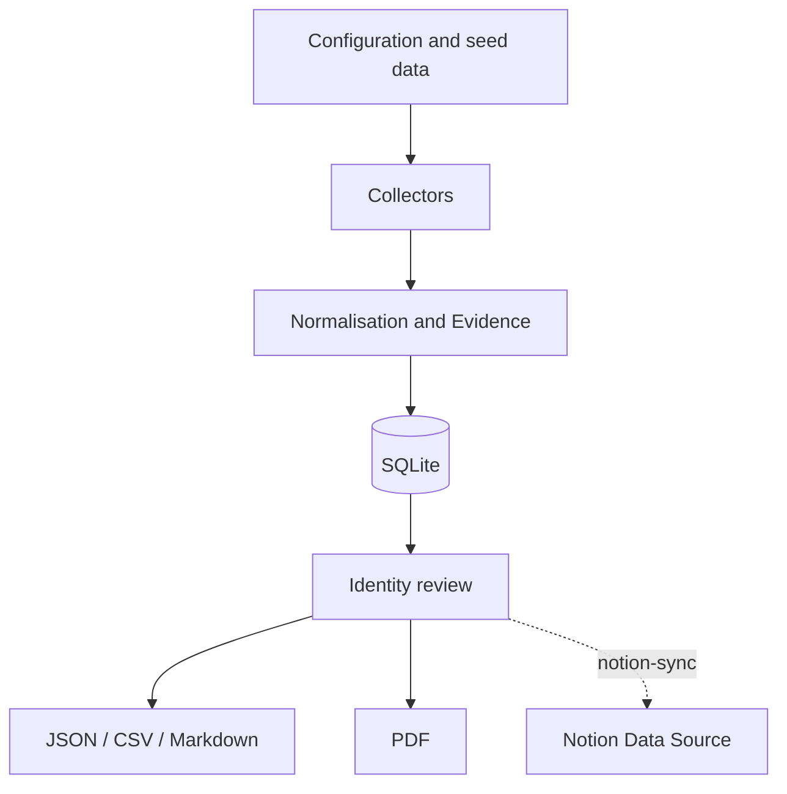

# Digital Footprint Map Generator

[English](README.md) | [Português](README.pt.md)

> **Current version: v2.0** — Spec-Driven Development adopted.
> All features are formally specified. See [CHANGELOG](#changelog) for the full history.

A reproducible, auditable OSINT tool for collecting, recording, reviewing, and
publishing public evidence about a person's digital footprint (initial subject:
Aridio Silva). The package cleanly separates **data collection** from
**report generation**, and is now maintained under the
[Spec-Driven Development](#spec-driven-development) methodology.

---

## Table of Contents

- [What's included](#whats-included)
- [Quick Start](#quick-start)
- [Installation](#installation)
- [CLI Reference](#cli-reference)
- [Tests](#tests)
- [Project Structure — v2.0 (current)](#project-structure--v20-current)
- [Project Structure — v1.0 (reference)](#project-structure--v10-reference)
- [Spec-Driven Development](#spec-driven-development)
- [Feature Index](#feature-index)
- [Bug Registry](#bug-registry)
- [Architecture](#architecture)
- [Collector Map](#collector-map)
- [Methodology](#methodology)
- [Data Dictionary](#data-dictionary)
- [Notion Integration](#notion-integration)
- [Contributing & Branch Protection](#contributing--branch-protection)
- [Changelog](#changelog)
- [License](#license)

---

## What's included

- Collectors for web pages, GitHub, and OpenAlex;
- Manual import of Google Scholar and National Library results;
- SQLite database with full audit trail and SHA-256 deduplication;
- Normalisation, deduplication, and identity review workflow;
- JSON, CSV, and Markdown export;
- PDF report generation;
- Optional, idempotent, explicit synchronisation with a Notion data source;
- 63 automated tests (100 % passing), lint-clean codebase;
- Full Spec-Driven Development structure in `.kiro/specs/`;
- Bug registry in `docs/bugs/`;
- Daily processing logs in `docs/logs/`.

The software collects only publicly accessible content and never attempts to
bypass logins, CAPTCHAs, `robots.txt`, or access controls. Results must be
reviewed by a human before publication to prevent mistaken identity.

---

## Quick Start

```bash
# 1 – clone and set up
python -m venv .venv && source .venv/bin/activate   # Windows: .venv\Scripts\activate
pip install -e ".[dev]"
cp .env.example .env

# 2 – initialise and load seed data
pegada init
pegada import-seed data/seed/evidencias_iniciais.json

# 3 – run collectors (requires internet)
pegada collect --config config/collector.toml

# 4 – export and report
pegada export --all
pegada report --format pdf
```

Outputs are written to `output/`. For a fully **offline** demonstration:

```bash
pegada init
pegada import-seed data/seed/evidencias_iniciais.json
pegada export --all
pegada report --format pdf
```

---

## Installation

Python 3.11 or later is required.

```bash
python -m venv .venv
source .venv/bin/activate        # Windows: .venv\Scripts\activate
pip install -e ".[dev]"
cp .env.example .env
```

| Extra | Command | Installs |
|---|---|---|
| Development (tests + lint) | `pip install -e ".[dev]"` | pytest, ruff |
| Notion integration | `pip install -e ".[notion]"` | notion-client |

---

## CLI Reference

| Command | Description |
|---|---|
| `pegada init` | Initialise database and output directory |
| `pegada import-seed <path>` | Load seed JSON into the database |
| `pegada import-csv <path> --kind <cat>` | Import a CSV file with a given category |
| `pegada collect [--config <path>]` | Run all enabled collectors (default config: `config/collector.toml`) |
| `pegada export [--all]` | Export JSON (always); add CSV + Markdown with `--all` |
| `pegada report [--format pdf]` | Generate PDF report |
| `pegada notion-sync [--dry-run] [--only-reviewed]` | Sync reviewed evidence to Notion |

See `BUILD.md` for the full build, test, and CLI reference.

---

## Tests

```bash
pip install -e ".[dev]"
python -m pytest          # 63 tests, all passing
python -m ruff check .    # lint
```

| Test file | Coverage |
|---|---|
| `tests/test_models.py` | Evidence model and fingerprint |
| `tests/test_db.py` | SQLite persistence and deduplication |
| `tests/test_exporters.py` | JSON, CSV, Markdown export |
| `tests/test_notion_sync.py` | Notion idempotency, schema validation, dry-run |
| `tests/test_importers.py` | CSV/JSON import, author splitting, BOM, defaults |
| `tests/test_report.py` | PDF generation smoke tests |
| `tests/test_cli.py` | CLI integration (all subcommands) |

GitHub Actions runs `pytest` + `ruff check .` on every PR and push to `main`.

---

## Project Structure — v2.0 (current)

```text
Digital_Footprint_Map/                   ← v2.0 — Spec-Driven Development
│
├── README.md                            # This file (English, GitHub homepage).
├── README.pt.md                         # Full Portuguese documentation.
├── BUILD.md                             # Build, test, and CLI reference guide.
├── LICENSE                              # Apache 2.0.
├── Makefile                             # install / test / lint / demo / clean.
├── pyproject.toml                       # v1.1.0, dependencies, package config.
├── .env.example                         # Environment variable template.
├── .gitignore
│
├── .kiro/                               # ← NEW in v2.0
│   ├── specs/
│   │   ├── SPEC.md                      # Project-level spec index.
│   │   ├── evidence-model/              # F-0001
│   │   ├── auditable-database/          # F-0002
│   │   ├── evidence-collectors/         # F-0003
│   │   ├── evidence-importers/          # F-0004
│   │   ├── evidence-exporters/          # F-0005
│   │   ├── pdf-report/                  # F-0006
│   │   ├── notion-sync/                 # F-0007
│   │   ├── cli-interface/               # F-0008
│   │   ├── bug-registry/                # BUG-REGISTRY spec
│   │   ├── feature-id-prefix/           # FEAT-ID-PREFIX spec
│   │   └── processing-log/              # PROC-LOG spec
│   └── steering/
│       └── project-conventions.md       # Always-loaded Kiro rules.
│
├── config/
│   └── collector.toml
│
├── data/
│   ├── import/
│   │   ├── biblioteca_nacional.csv
│   │   └── google_scholar.csv
│   ├── seed/
│   │   └── evidencias_iniciais.json
│   └── pegada.sqlite3
│
├── docs/                                # ← EXPANDED in v2.0
│   ├── ARQUITETURA.md
│   ├── DICIONARIO_DE_DADOS.md
│   ├── INTEGRACAO_NOTION.md
│   ├── MAPA_DO_COLETOR.md
│   ├── METODOLOGIA.md
│   ├── bugs/                            # ← NEW in v2.0
│   │   ├── BUG_REGISTRY.md              # Central bug index.
│   │   └── BUG-00001.md                 # ValueError on whitespace confidence CSV cell.
│   ├── logs/                            # ← NEW in v2.0
│   │   └── LOG_PROCESSAMENTO_26082026.md
│   └── relatorios/
│       ├── Mapa_Pegada_Digital_Aridio_Silva.pdf
│       └── Mapa_Pegada_Digital_Aridio_Silva_Atualizado_Bibliografia.pdf
│
├── output/
│   └── .gitkeep
│
├── src/
│   └── pegada/
│       ├── __init__.py
│       ├── cli.py
│       ├── collectors.py
│       ├── config.py
│       ├── db.py
│       ├── exporters.py
│       ├── importers.py                 # BUG-00001 fixed here (PR #7)
│       ├── models.py
│       ├── notion_sync.py
│       └── report.py
│
└── tests/                               # ← EXPANDED in v2.0 (4 → 7 files, 7 → 63 tests)
    ├── test_cli.py                      # NEW — 23 CLI integration tests
    ├── test_db.py
    ├── test_exporters.py
    ├── test_importers.py                # NEW — 17 importer unit tests
    ├── test_models.py
    ├── test_notion_sync.py
    └── test_report.py                   # NEW — 14 PDF smoke tests
```

---

## Project Structure — v1.0 (reference)

> This is the structure preserved under tag `v1.0` (commit `628c10a`).
> Access it with `git checkout v1.0`.

```text
Digital_Footprint_Map/                   ← v1.0 — no spec structure
│
├── README.md
├── README.en.md
├── LICENSE
├── Makefile
├── pyproject.toml
├── .env.example
├── .gitignore
│
├── config/
│   └── collector.toml
│
├── data/
│   ├── import/
│   │   ├── biblioteca_nacional.csv
│   │   └── google_scholar.csv
│   ├── seed/
│   │   └── evidencias_iniciais.json
│   └── pegada.sqlite3
│
├── docs/
│   ├── ARQUITETURA.md
│   ├── DICIONARIO_DE_DADOS.md
│   ├── INTEGRACAO_NOTION.md
│   ├── MAPA_DO_COLETOR.md
│   ├── METODOLOGIA.md
│   └── relatorios/
│       ├── Mapa_Pegada_Digital_Aridio_Silva.pdf
│       └── Mapa_Pegada_Digital_Aridio_Silva_Atualizado_Bibliografia.pdf
│
├── output/
│   └── .gitkeep
│
├── src/
│   └── pegada/
│       ├── __init__.py
│       ├── cli.py
│       ├── collectors.py
│       ├── config.py
│       ├── db.py
│       ├── exporters.py
│       ├── importers.py
│       ├── models.py
│       ├── notion_sync.py
│       └── report.py
│
└── tests/                               # 7 tests in 4 files
    ├── test_db.py
    ├── test_exporters.py
    ├── test_models.py
    └── test_notion_sync.py
```

**Key differences v1.0 → v2.0:**

| Area | v1.0 | v2.0 |
|---|---|---|
| Spec structure | None | 11 specs in `.kiro/specs/` |
| Steering rules | None | `.kiro/steering/project-conventions.md` |
| Tests | 7 (4 files) | 63 (7 files) |
| Build docs | None | `BUILD.md` |
| Bug registry | None | `docs/bugs/` (BUG-00001) |
| Processing logs | None | `docs/logs/` |
| Feature IDs | None | `F-0001`–`F-0008` |
| Bug IDs | None | `BUG-00001`–`BUG-99999` |
| Source fix | 1 bug present | BUG-00001 fixed in PR #7 |

---

## Spec-Driven Development

From v2.0, every feature and bugfix follows a mandatory specification workflow
before any code is written:

```
Idea / bug report
      │
      ▼
requirements.md  ──▶  design.md  ──▶  tasks.md  ──▶  Implementation  ──▶  Tests
      │
 (human review at each stage)
```

All spec files live in `.kiro/specs/{feature-name}/` and consist of:

- **`requirements.md`** — user stories with EARS-format acceptance criteria
  (WHEN / THEN / SHALL) and correctness properties for property-based testing
- **`design.md`** — component location, data flows, algorithms, design
  decisions with rationale
- **`tasks.md`** — atomic, implementable task list with `[x]` / `[ ]` status

The `.kiro/specs/SPEC.md` file is the project-level index of all specs.

---

## Feature Index

| ID | Feature | Status | Spec |
|---|---|---|---|
| F-0001 | Evidence Model & Fingerprint | ✅ | [evidence-model](.kiro/specs/evidence-model/requirements.md) |
| F-0002 | Auditable SQLite Database | ✅ | [auditable-database](.kiro/specs/auditable-database/requirements.md) |
| F-0003 | Evidence Collectors (Web / GitHub / OpenAlex) | ✅ | [evidence-collectors](.kiro/specs/evidence-collectors/requirements.md) |
| F-0004 | Evidence Importers (CSV / JSON) | ✅ | [evidence-importers](.kiro/specs/evidence-importers/requirements.md) |
| F-0005 | Evidence Exporters (JSON / CSV / Markdown) | ✅ | [evidence-exporters](.kiro/specs/evidence-exporters/requirements.md) |
| F-0006 | PDF Report Generator | ✅ | [pdf-report](.kiro/specs/pdf-report/requirements.md) |
| F-0007 | Notion Sync | ✅ | [notion-sync](.kiro/specs/notion-sync/requirements.md) |
| F-0008 | CLI Interface | ✅ | [cli-interface](.kiro/specs/cli-interface/requirements.md) |

Next available: **F-0009**

---

## Bug Registry

| ID | Title | Component | Severity | Status |
|---|---|---|---|---|
| [BUG-00001](docs/bugs/BUG-00001.md) | ValueError on whitespace `confidence` CSV cell | F-0004 importers | Medium | Verified |

Full index: [docs/bugs/BUG_REGISTRY.md](docs/bugs/BUG_REGISTRY.md) · Next available: **BUG-00002**

---

## Architecture



The SHA-256 `fingerprint` prevents exact duplication by URL, title, and
category. Identity status starts as `pending`; only reviewed evidence should be
marked `reviewed`. Collectors fail independently so that an unavailable source
does not interrupt the others.

Notion publishing is explicit and idempotent. Before writing, the connector
validates the remote schema and queries existing fingerprints. Each record is
then created or updated; `--dry-run` lets you inspect the plan safely.

---

## Collector Map

| Stage | Input | Component | Output |
|---|---|---|---|
| Configuration | TOML + env vars | `config.py` | sources and limits |
| Web collection | Public URL | `WebCollector` | title, summary, final URL |
| GitHub | Public user | `GitHubCollector` | profile and repositories |
| Academic | Name query | `OpenAlexCollector` | candidate works |
| Import | Reviewed CSV/JSON | `importers.py` | structured evidence |
| Normalisation | Heterogeneous data | `Evidence` | unified schema + hash |
| Persistence | Evidence | `Repository` | auditable SQLite |
| Publication | Reviewed database | `exporters.py`, `report.py` | JSON, CSV, MD, PDF |
| Notion | Reviewed database | `notion_sync.py` | Notion data source pages |

**Operating rules:** never bypass auth/CAPTCHAs; respect `robots.txt`; treat
name-query results as candidates; always record URL, source, date, confidence,
and notes.

---

## Methodology

The map follows the chain: professional history → books → academic references
→ GitHub → articles → AI/ML.

**Classification:**
- `reviewed` — identity confirmed by multiple signals or by the subject
- `pending` — candidate not yet validated
- `rejected` — namesake or incorrect attribution
- `confidence` (0–1) — attribution strength, not content quality

**Sources:** primary and institutional sources take priority. Google Scholar
must be imported manually. National Library records need an official URL or
catalogue number. Citations should point to the work that uses the source.

**LGPD / Ethics:** collect only public data relevant to the purpose. Avoid
sensitive data. Document corrections and removals. Do not republish complete
pages or protected content.

---

## Data Dictionary

| Field | Meaning |
|---|---|
| `title` | evidence title |
| `url` | stable address or URN |
| `source` | editorial or institutional origin |
| `category` | profile, book, academic, repository, web… |
| `snippet` | short summary (no extended copying) |
| `published_at` | publication date or year |
| `authors` | authors declared by the source |
| `identifiers` | ISBN, DOI, OpenAlex ID, etc. |
| `collected_at` | UTC collection timestamp |
| `identity_status` | `pending` / `reviewed` / `rejected` |
| `confidence` | 0–1 attribution strength |
| `notes` | caveats and validation tasks |
| `fingerprint` | SHA-256 used for deduplication |

---

## Notion Integration

1. Create an integration at `notion.so/profile/integrations` and copy the token.
2. In Notion, create a data source with the columns described in
   `docs/INTEGRACAO_NOTION.md` and share it with the integration.
3. Copy `.env.example` to `.env` and set `NOTION_TOKEN` and
   `NOTION_DATA_SOURCE_ID`.
4. Dry-run before writing:

```bash
pip install -e ".[notion]"
pegada notion-sync --dry-run --only-reviewed
pegada notion-sync --only-reviewed
```

The connector uses `Fingerprint` to create or update pages without duplicates,
validates the remote schema before any write, and sends nothing without an
explicit `notion-sync` command.

---

## Contributing & Branch Protection

The `main` branch has an active ruleset:
- changes must arrive via pull request; direct pushes are blocked;
- branch deletion and force pushes are blocked;
- the `test` CI check must pass before merge;
- required approvals: 0 (maintainer can self-merge after CI passes).

```bash
git switch -c feat/my-change        # or fix/... for bugfixes
git add <files>
git commit -m "type(scope): description"
git push -u origin feat/my-change
# open PR → wait for CI → merge
```

**Commit types:** `feat`, `fix`, `test`, `docs`, `chore`, `refactor`

---

## Changelog

| Version | Tag | Date | Description |
|---|---|---|---|
| v2.0 | `v2.0` | 2026-08-26 | SDD adoption, 8 reverse-engineered specs, 63 tests, bug registry, processing logs |
| v1.1.0 | — | 2026-08 | Notion integration, English README |
| v1.0 | `v1.0` | 2026-08-26¹ | Pre-SDD baseline (tag preserving original state) |

¹ Tag applied retroactively to the last commit before SDD adoption.

**v2.0 PRs:**

| PR | Title | Type |
|---|---|---|
| #6 | Adopt SDD — reverse-engineered specs for 8 features | feat |
| #7 | 17 importer tests + fix BUG-00001 | test + fix |
| #8 | 14 PDF smoke tests | test |
| #9 | 23 CLI integration tests | test |
| #10 | Bug registry + BUG-00001 report | docs |
| #11 | Rename feature IDs to F-XXXX format | docs |
| #12 | Processing log standard + LOG 26/08/2026 | docs |

---

## License

Copyright (c) 2026 Aridio Silva. Distributed under the
[Apache License 2.0](LICENSE).

Permits use, copying, modification, and distribution (including commercial),
provided the licence and applicable notices are retained. Includes an express
patent grant; derivative works need not be open-sourced.

> **Notice:** Defensive OSINT and self-audit tool. Respect LGPD, copyright,
> site terms, and removal requests. URLs and excerpts are evidence records;
> they do not automatically confirm identity.
