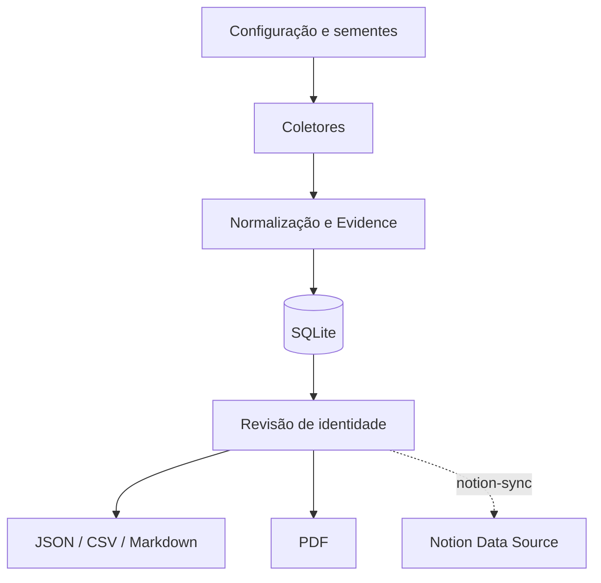

# Gerador do Mapa da Pegada Digital

[English](README.md) | [Português](README.pt.md)

> **Versão atual: v2.0** — Spec-Driven Development adotado.
> Todas as features possuem especificação formal. Veja o [Histórico de versões](#histórico-de-versões).

Projeto reproduzível e auditável de OSINT defensiva para coletar, registrar,
revisar e publicar evidências **públicas** sobre a pegada digital de uma pessoa
física (sujeito inicial: Aridio Silva). O pacote separa **coleta de dados** de
**geração de relatório** e é mantido sob a metodologia
[Spec-Driven Development](#spec-driven-development).

---

## Índice

- [O que está incluído](#o-que-está-incluído)
- [Uso rápido](#uso-rápido)
- [Instalação](#instalação)
- [Referência da CLI](#referência-da-cli)
- [Testes](#testes)
- [Estrutura do projeto — v2.0 (atual)](#estrutura-do-projeto--v20-atual)
- [Estrutura do projeto — v1.0 (referência)](#estrutura-do-projeto--v10-referência)
- [Spec-Driven Development](#spec-driven-development)
- [Índice de features](#índice-de-features)
- [Registro de bugs](#registro-de-bugs)
- [Arquitetura](#arquitetura)
- [Mapa do coletor](#mapa-do-coletor)
- [Metodologia](#metodologia)
- [Dicionário de dados](#dicionário-de-dados)
- [Integração com o Notion](#integração-com-o-notion)
- [Contribuição e proteção da main](#contribuição-e-proteção-da-main)
- [Histórico de versões](#histórico-de-versões)
- [Licença](#licença)

---

## O que está incluído

- Coletores para páginas web, GitHub e OpenAlex;
- Importação manual de resultados do Google Acadêmico e da Biblioteca Nacional;
- Banco SQLite com trilha de auditoria completa e deduplicação por SHA-256;
- Normalização, deduplicação e fluxo de revisão de identidade;
- Exportação JSON, CSV e Markdown;
- Geração de relatório PDF;
- Sincronização opcional, idempotente e explícita com uma fonte de dados do Notion;
- 63 testes automatizados (100 % passando), código limpo de lint;
- Estrutura completa de Spec-Driven Development em `.kiro/specs/`;
- Registro de bugs em `docs/bugs/`;
- Logs de processamento diários em `docs/logs/`.

O software coleta apenas conteúdo publicamente acessível e não tenta contornar
login, CAPTCHA, `robots.txt` ou bloqueios. Resultados devem ser revisados por
uma pessoa antes da publicação para evitar homônimos.

---

## Uso rápido

```bash
# 1 – clone e configuração
python -m venv .venv && source .venv/bin/activate   # Windows: .venv\Scripts\activate
pip install -e ".[dev]"
cp .env.example .env

# 2 – inicializar e carregar dados semente
pegada init
pegada import-seed data/seed/evidencias_iniciais.json

# 3 – executar coletores (requer internet)
pegada collect --config config/collector.toml

# 4 – exportar e gerar relatório
pegada export --all
pegada report --format pdf
```

Saídas são gravadas em `output/`. Para demonstração **offline**:

```bash
pegada init
pegada import-seed data/seed/evidencias_iniciais.json
pegada export --all
pegada report --format pdf
```

---

## Instalação

Requer Python 3.11 ou superior.

```bash
python -m venv .venv
source .venv/bin/activate        # Windows: .venv\Scripts\activate
pip install -e ".[dev]"
cp .env.example .env
```

| Extra | Comando | Instala |
|---|---|---|
| Desenvolvimento (testes + lint) | `pip install -e ".[dev]"` | pytest, ruff |
| Integração Notion | `pip install -e ".[notion]"` | notion-client |

---

## Referência da CLI

| Comando | Descrição |
|---|---|
| `pegada init` | Inicializa banco de dados e diretório de saídas |
| `pegada import-seed <path>` | Carrega JSON semente no banco |
| `pegada import-csv <path> --kind <cat>` | Importa CSV com categoria especificada |
| `pegada collect [--config <path>]` | Executa todos os coletores habilitados |
| `pegada export [--all]` | Exporta JSON (sempre); adiciona CSV + Markdown com `--all` |
| `pegada report [--format pdf]` | Gera relatório PDF |
| `pegada notion-sync [--dry-run] [--only-reviewed]` | Sincroniza evidências revisadas com Notion |

Consulte `BUILD.md` para a referência completa de build, testes e CLI.

---

## Testes

```bash
pip install -e ".[dev]"
python -m pytest          # 63 testes, todos passando
python -m ruff check .    # lint
```

| Arquivo de teste | Cobertura |
|---|---|
| `tests/test_models.py` | Modelo Evidence e fingerprint |
| `tests/test_db.py` | Persistência SQLite e deduplicação |
| `tests/test_exporters.py` | Exportação JSON, CSV e Markdown |
| `tests/test_notion_sync.py` | Idempotência, validação de esquema e dry-run do Notion |
| `tests/test_importers.py` | Importação CSV/JSON, split de autores, BOM, defaults |
| `tests/test_report.py` | Smoke tests de geração de PDF |
| `tests/test_cli.py` | Integração da CLI (todos os subcomandos) |

O GitHub Actions executa `pytest` + `ruff check .` automaticamente em cada PR
e push à `main`.

---

## Estrutura do projeto — v2.0 (atual)

```text
Digital_Footprint_Map/                   ← v2.0 — Spec-Driven Development
│
├── README.md                            # Documentação principal em inglês (homepage do GitHub).
├── README.pt.md                         # Esta documentação em português.
├── BUILD.md                             # Guia de build, testes e CLI.
├── LICENSE                              # Apache 2.0.
├── Makefile                             # install / test / lint / demo / clean.
├── pyproject.toml                       # v1.1.0, dependências e configuração do pacote.
├── .env.example                         # Modelo de variáveis de ambiente.
├── .gitignore
│
├── .kiro/                               # ← NOVO na v2.0
│   ├── specs/
│   │   ├── SPEC.md                      # Índice de specs do projeto.
│   │   ├── evidence-model/              # F-0001
│   │   ├── auditable-database/          # F-0002
│   │   ├── evidence-collectors/         # F-0003
│   │   ├── evidence-importers/          # F-0004
│   │   ├── evidence-exporters/          # F-0005
│   │   ├── pdf-report/                  # F-0006
│   │   ├── notion-sync/                 # F-0007
│   │   ├── cli-interface/               # F-0008
│   │   ├── bug-registry/                # Spec do registro de bugs
│   │   ├── feature-id-prefix/           # Spec do padrão F-XXXX
│   │   └── processing-log/              # Spec do log de processamento
│   └── steering/
│       └── project-conventions.md       # Regras carregadas automaticamente pelo Kiro.
│
├── config/
│   └── collector.toml
│
├── data/
│   ├── import/
│   │   ├── biblioteca_nacional.csv
│   │   └── google_scholar.csv
│   ├── seed/
│   │   └── evidencias_iniciais.json
│   └── pegada.sqlite3
│
├── docs/                                # ← EXPANDIDO na v2.0
│   ├── ARQUITETURA.md
│   ├── DICIONARIO_DE_DADOS.md
│   ├── INTEGRACAO_NOTION.md
│   ├── MAPA_DO_COLETOR.md
│   ├── METODOLOGIA.md
│   ├── bugs/                            # ← NOVO na v2.0
│   │   ├── BUG_REGISTRY.md              # Índice central de bugs.
│   │   └── BUG-00001.md                 # ValueError em célula confidence com espaço.
│   ├── logs/                            # ← NOVO na v2.0
│   │   └── LOG_PROCESSAMENTO_26082026.md
│   └── relatorios/
│       ├── Mapa_Pegada_Digital_Aridio_Silva.pdf
│       └── Mapa_Pegada_Digital_Aridio_Silva_Atualizado_Bibliografia.pdf
│
├── output/
│   └── .gitkeep
│
├── src/
│   └── pegada/
│       ├── __init__.py
│       ├── cli.py
│       ├── collectors.py
│       ├── config.py
│       ├── db.py
│       ├── exporters.py
│       ├── importers.py                 # BUG-00001 corrigido aqui (PR #7)
│       ├── models.py
│       ├── notion_sync.py
│       └── report.py
│
└── tests/                               # ← EXPANDIDO na v2.0 (4 → 7 arquivos, 7 → 63 testes)
    ├── test_cli.py                      # NOVO — 23 testes de integração da CLI
    ├── test_db.py
    ├── test_exporters.py
    ├── test_importers.py                # NOVO — 17 testes unitários de importers
    ├── test_models.py
    ├── test_notion_sync.py
    └── test_report.py                   # NOVO — 14 smoke tests de PDF
```

---

## Estrutura do projeto — v1.0 (referência)

> Estado preservado pela tag `v1.0` (commit `628c10a`).
> Acesse com `git checkout v1.0`.

```text
Digital_Footprint_Map/                   ← v1.0 — sem estrutura de spec
│
├── README.md
├── README.en.md
├── LICENSE
├── Makefile
├── pyproject.toml
├── .env.example
├── .gitignore
│
├── config/
│   └── collector.toml
│
├── data/
│   ├── import/
│   │   ├── biblioteca_nacional.csv
│   │   └── google_scholar.csv
│   ├── seed/
│   │   └── evidencias_iniciais.json
│   └── pegada.sqlite3
│
├── docs/
│   ├── ARQUITETURA.md
│   ├── DICIONARIO_DE_DADOS.md
│   ├── INTEGRACAO_NOTION.md
│   ├── MAPA_DO_COLETOR.md
│   ├── METODOLOGIA.md
│   └── relatorios/
│       ├── Mapa_Pegada_Digital_Aridio_Silva.pdf
│       └── Mapa_Pegada_Digital_Aridio_Silva_Atualizado_Bibliografia.pdf
│
├── output/
│   └── .gitkeep
│
├── src/
│   └── pegada/
│       ├── __init__.py
│       ├── cli.py
│       ├── collectors.py
│       ├── config.py
│       ├── db.py
│       ├── exporters.py
│       ├── importers.py
│       ├── models.py
│       ├── notion_sync.py
│       └── report.py
│
└── tests/                               # 7 testes em 4 arquivos
    ├── test_db.py
    ├── test_exporters.py
    ├── test_models.py
    └── test_notion_sync.py
```

**Diferenças principais v1.0 → v2.0:**

| Área | v1.0 | v2.0 |
|---|---|---|
| Estrutura de spec | Nenhuma | 11 specs em `.kiro/specs/` |
| Regras de projeto | Nenhuma | `.kiro/steering/project-conventions.md` |
| Testes | 7 (4 arquivos) | 63 (7 arquivos) |
| Documentação de build | Nenhuma | `BUILD.md` |
| Registro de bugs | Nenhum | `docs/bugs/` (BUG-00001) |
| Logs de processamento | Nenhum | `docs/logs/` |
| IDs de feature | Nenhum | `F-0001`–`F-0008` |
| IDs de bug | Nenhum | `BUG-00001`–`BUG-99999` |
| Correção de código | 1 bug presente | BUG-00001 corrigido no PR #7 |

---

## Spec-Driven Development

A partir da v2.0, toda feature e bugfix segue um fluxo obrigatório de
especificação **antes** de qualquer código ser escrito:

```
Ideia / relatório de bug
         │
         ▼
requirements.md  ──▶  design.md  ──▶  tasks.md  ──▶  Implementação  ──▶  Testes
         │
  (revisão humana a cada etapa)
```

Todos os arquivos de spec ficam em `.kiro/specs/{nome-da-feature}/` e são
compostos por:

- **`requirements.md`** — user stories com critérios de aceitação no formato
  EARS (WHEN / THEN / SHALL) e propriedades de correção para property-based
  testing
- **`design.md`** — localização do componente, fluxos de dados, algoritmos e
  decisões de design com justificativa
- **`tasks.md`** — lista de tarefas atômicas e implementáveis com status
  `[x]` / `[ ]`

O arquivo `.kiro/specs/SPEC.md` é o índice de nível de projeto de todas as specs.

---

## Índice de features

| ID | Feature | Status | Spec |
|---|---|---|---|
| F-0001 | Evidence Model & Fingerprint | ✅ | [evidence-model](.kiro/specs/evidence-model/requirements.md) |
| F-0002 | Auditable SQLite Database | ✅ | [auditable-database](.kiro/specs/auditable-database/requirements.md) |
| F-0003 | Evidence Collectors (Web / GitHub / OpenAlex) | ✅ | [evidence-collectors](.kiro/specs/evidence-collectors/requirements.md) |
| F-0004 | Evidence Importers (CSV / JSON) | ✅ | [evidence-importers](.kiro/specs/evidence-importers/requirements.md) |
| F-0005 | Evidence Exporters (JSON / CSV / Markdown) | ✅ | [evidence-exporters](.kiro/specs/evidence-exporters/requirements.md) |
| F-0006 | PDF Report Generator | ✅ | [pdf-report](.kiro/specs/pdf-report/requirements.md) |
| F-0007 | Notion Sync | ✅ | [notion-sync](.kiro/specs/notion-sync/requirements.md) |
| F-0008 | CLI Interface | ✅ | [cli-interface](.kiro/specs/cli-interface/requirements.md) |

Próxima disponível: **F-0009**

---

## Registro de bugs

| ID | Título | Componente | Severidade | Status |
|---|---|---|---|---|
| [BUG-00001](docs/bugs/BUG-00001.md) | ValueError em célula `confidence` com espaço no CSV | F-0004 importers | Medium | Verified |

Índice completo: [docs/bugs/BUG_REGISTRY.md](docs/bugs/BUG_REGISTRY.md) · Próximo disponível: **BUG-00002**

---

## Arquitetura



O `fingerprint` SHA-256 impede duplicação exata por URL, título e categoria.
O status de identidade começa como `pending`; apenas evidências revisadas
devem receber `reviewed`. Coletores falham isoladamente para que uma origem
indisponível não interrompa as demais.

---

## Mapa do coletor

| Etapa | Entrada | Componente | Saída |
|---|---|---|---|
| Configuração | TOML e variáveis de ambiente | `config.py` | fontes e limites |
| Coleta web | URL pública | `WebCollector` | título, resumo, URL final |
| GitHub | Usuário público | `GitHubCollector` | perfil e repositórios |
| Acadêmico | Consulta nominal | `OpenAlexCollector` | trabalhos candidatos |
| Importação | CSV/JSON revisado | `importers.py` | evidências estruturadas |
| Normalização | Dados heterogêneos | `Evidence` | esquema único e hash |
| Persistência | Evidências | `Repository` | SQLite auditável |
| Publicação | Banco revisado | `exporters.py`, `report.py` | JSON, CSV, MD e PDF |
| Notion | Banco revisado | `notion_sync.py` | páginas na fonte de dados |

**Regras operacionais:** não contornar autenticação/CAPTCHA; respeitar
`robots.txt`; tratar resultados nominais como candidatos; registrar URL,
fonte, data, confiança e observações.

---

## Metodologia

O mapa segue a cadeia: trajetória profissional → livros → referências
acadêmicas → GitHub → artigos → inteligência artificial.

**Classificação:**
- `reviewed` — identidade conferida por múltiplos sinais ou pelo titular
- `pending` — candidato ainda não validado
- `rejected` — homônimo ou atribuição incorreta
- `confidence` (0–1) — força da atribuição, não qualidade do conteúdo

**Fontes:** primárias e institucionais têm prioridade. Google Acadêmico deve
ser importado manualmente. Biblioteca Nacional precisa de URL ou número
oficial. Citações devem apontar para a obra que as contém.

**LGPD / Ética:** coletar apenas dados públicos pertinentes. Evitar dados
sensíveis. Documentar correções e remoções. Não republicar páginas completas
nem conteúdo protegido.

---

## Dicionário de dados

| Campo | Significado |
|---|---|
| `title` | título da evidência |
| `url` | endereço ou URN estável |
| `source` | origem editorial/institucional |
| `category` | perfil, livro, acadêmico, repositório, web… |
| `snippet` | resumo curto, sem copiar conteúdo extenso |
| `published_at` | data/ano de publicação |
| `authors` | autores declarados pela fonte |
| `identifiers` | ISBN, DOI, OpenAlex e outros |
| `collected_at` | instante UTC da coleta |
| `identity_status` | `pending` / `reviewed` / `rejected` |
| `confidence` | confiança de 0 a 1 |
| `notes` | ressalvas e tarefas de validação |
| `fingerprint` | SHA-256 usado na deduplicação |

---

## Integração com o Notion

1. Crie uma integração em `notion.so/profile/integrations` e copie o token.
2. No Notion, crie uma fonte de dados com as colunas descritas em
   `docs/INTEGRACAO_NOTION.md` e compartilhe-a com a integração.
3. Copie `.env.example` para `.env` e preencha `NOTION_TOKEN` e
   `NOTION_DATA_SOURCE_ID`.
4. Simule antes de gravar:

```bash
pip install -e ".[notion]"
pegada notion-sync --dry-run --only-reviewed
pegada notion-sync --only-reviewed
```

O conector usa `Fingerprint` para criar ou atualizar páginas sem duplicar,
valida o esquema remoto antes de qualquer escrita e não envia dados sem o
comando explícito `notion-sync`.

---

## Contribuição e proteção da main

A branch `main` possui ruleset ativo:
- alterações por pull request obrigatório; push direto bloqueado;
- exclusão e force push bloqueados;
- check `test` obrigatório antes do merge;
- aprovações obrigatórias: 0 (mantenedor pode integrar a própria PR).

```bash
git switch -c feat/minha-alteracao    # ou fix/... para correções
git add <arquivos>
git commit -m "tipo(escopo): descrição"
git push -u origin feat/minha-alteracao
# abrir PR → aguardar CI → merge
```

**Tipos de commit:** `feat`, `fix`, `test`, `docs`, `chore`, `refactor`

---

## Histórico de versões

| Versão | Tag | Data | Descrição |
|---|---|---|---|
| v2.0 | `v2.0` | 2026-08-26 | Adoção do SDD, 8 specs por engenharia reversa, 63 testes, registro de bugs, logs de processamento |
| v1.1.0 | — | 2026-08 | Integração com Notion, README em inglês |
| v1.0 | `v1.0` | 2026-08-26¹ | Baseline pré-SDD (tag preservando estado original) |

¹ Tag aplicada retroativamente ao último commit antes da adoção do SDD.

**PRs da v2.0:**

| PR | Título | Tipo |
|---|---|---|
| #6 | Adoção do SDD — specs de 8 features por engenharia reversa | feat |
| #7 | 17 testes de importers + correção BUG-00001 | test + fix |
| #8 | 14 smoke tests de geração de PDF | test |
| #9 | 23 testes de integração da CLI | test |
| #10 | Registro de bugs + relatório BUG-00001 | docs |
| #11 | Renomear IDs de feature para formato F-XXXX | docs |
| #12 | Padrão de log de processamento + LOG 26/08/2026 | docs |

---

## Licença

Copyright (c) 2026 Aridio Silva. Distribuído sob a
[Apache License 2.0](LICENSE).

Permite uso, cópia, modificação e distribuição (inclusive comercial), desde
que a licença e os avisos aplicáveis sejam preservados. Inclui concessão
expressa de patentes; obras derivadas não precisam ser abertas.

> **Aviso:** Ferramenta de OSINT defensiva e autoconsulta. Respeite LGPD,
> direitos autorais, termos dos sites e pedidos de remoção. URLs e trechos
> são evidências; não representam confirmação automática de identidade.
