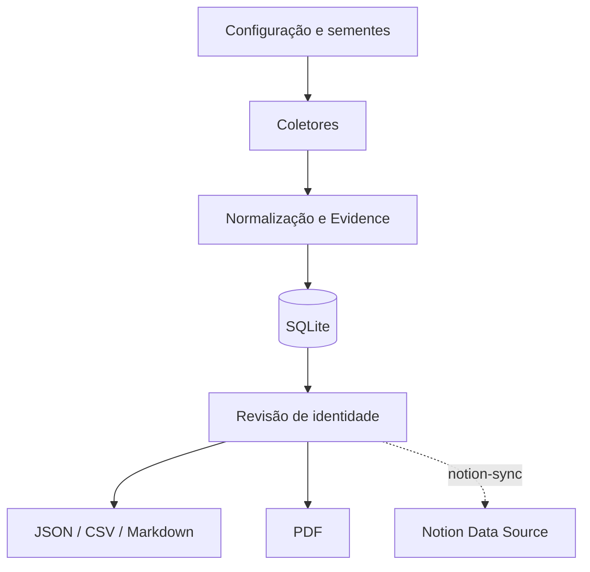

# Arquitetura

O `fingerprint` SHA-256 impede duplicação exata por URL, título e categoria. O status de identidade começa como `pending`; apenas evidências revisadas devem receber `reviewed`. Coletores falham isoladamente para que uma origem indisponível não interrompa as demais.

A publicação no Notion é explícita e idempotente. Antes de gravar, o conector
valida o esquema remoto e consulta os fingerprints existentes. Cada evidência é
então criada ou atualizada; `--dry-run` permite verificar o plano sem alterações.
