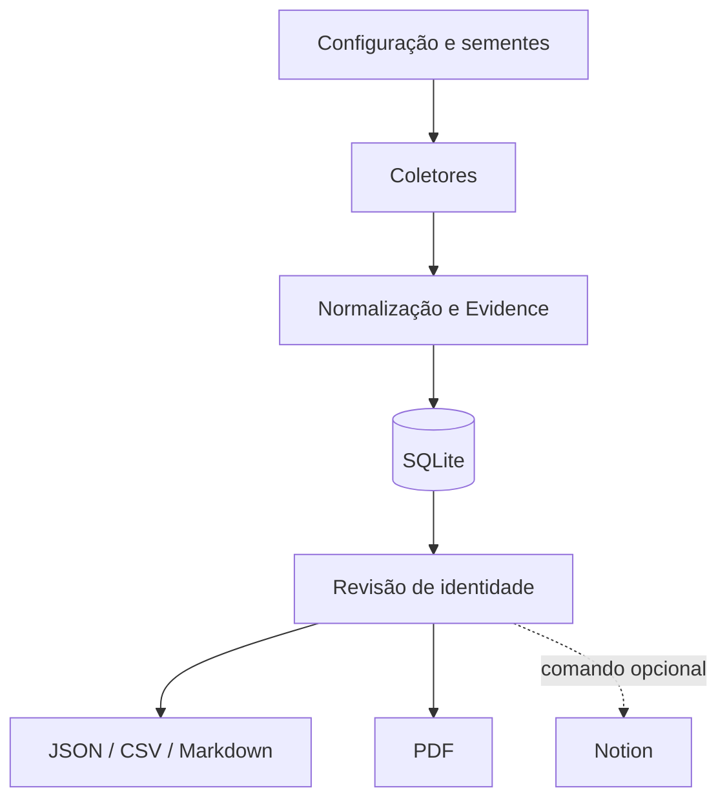

# Arquitetura

O `fingerprint` SHA-256 impede duplicação exata por URL, título e categoria. O status de identidade começa como `pending`; apenas evidências revisadas devem receber `reviewed`. Coletores falham isoladamente para que uma origem indisponível não interrompa as demais.
